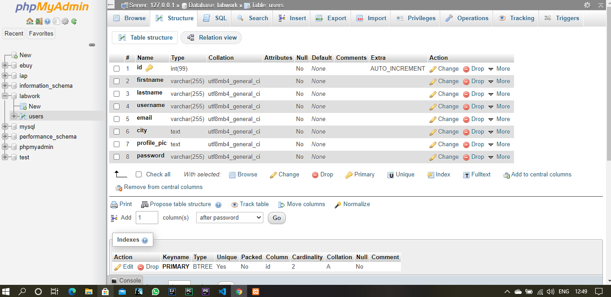

# IAP--Lab2
Lab 2 Assignment - PHP, PDO
1. This is Lab 2 Assignment involving the PDO of user authentication.
2. Download the sql database and then create a new database in phpMyAdmin with the name 'labwork'.
3.Create a table `users` with the following fields:
  
